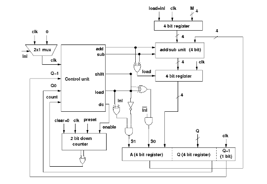

# Circuit diagram of 4 bit Booth's Multiplier:

# Components :
1. Controller
2. Registers, Adder/subtractor unit, multiplexer, down counter, logic gates to construct the datapath
3. Inputs
4. Outputs
5. Wires to connect

- Follow the below manual and perform the experiment
    - Manual --> [Click Here](./simulation/coavlNew.pdf)

<embed src="./simulation/coavlNew.pdf" type="application/pdf">

