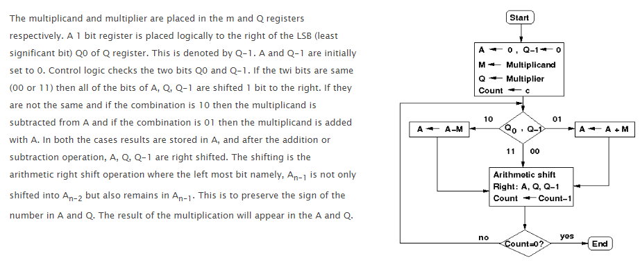
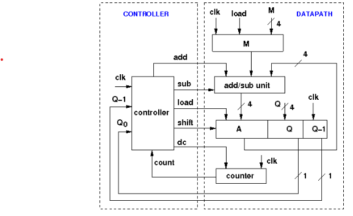

### Theory

## Booth's Multipliers:

Booth's multiplication algorithm is an algorithm which multiplies 2 signed integers in 2's complement. The algorithm is depicted in the following figure with a brief description. This approach uses fewer additions and subtractions than more straightforward algorithms.

## Design Issues :

Booth's algorithm can be implemented in many ways. This experiment is designed using a controller and a datapath. The operations on the data in the datapath is controlled by the control signal received from the controller. The datapath contains registers to hold multiplier, multiplicand, intermediate results, data processing units like ALU, adder/subtractor etc., counter and other combinational units. Following is the schemetic diagram of the Booth's multiplier which multiplies two 4-bit numbers in 2's complement of this experiment. Here the adder/subtractor unit is used as data processing unit.M, Q, A are 4-bit and Q-1 is a 1-bit rigister. M holds the multiplicand, Q holds the multiplier, A holds the results of adder/subtractor unit. The counter is a down counter which counts the number of operations needed for the multiplication. The data flow in the data path is controlled by the five control signals generated from the controller. these signals are load (to load data in registers), add (to initiate addition operation), sub (to initiate subtraction operation), shift (to initiate arithmetis right shift operation), dc (this is to decrement counter). The controller generates the control signals according to the input received from the datapath. Here the inputs are the least significant Q0 bit of Q register, Q-1 bit and count bit from the down counter.

